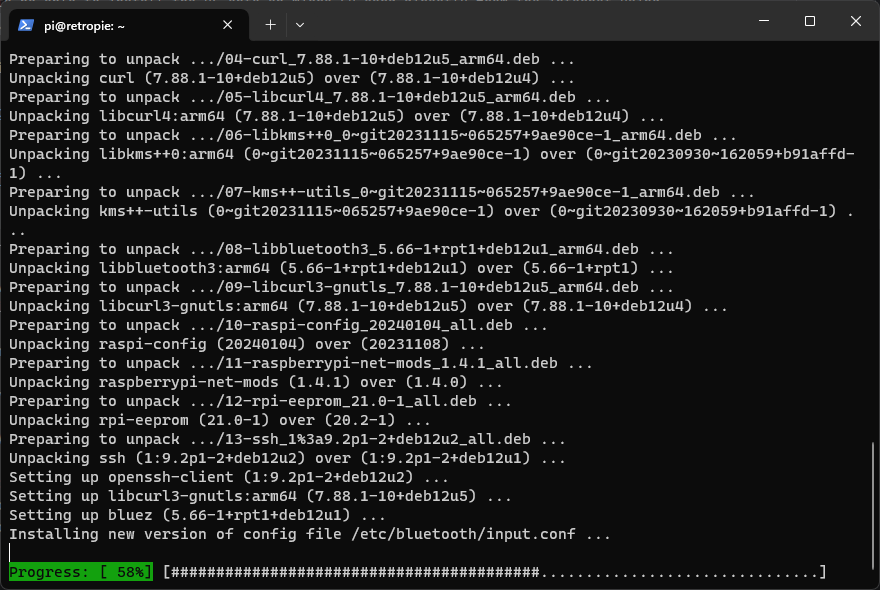
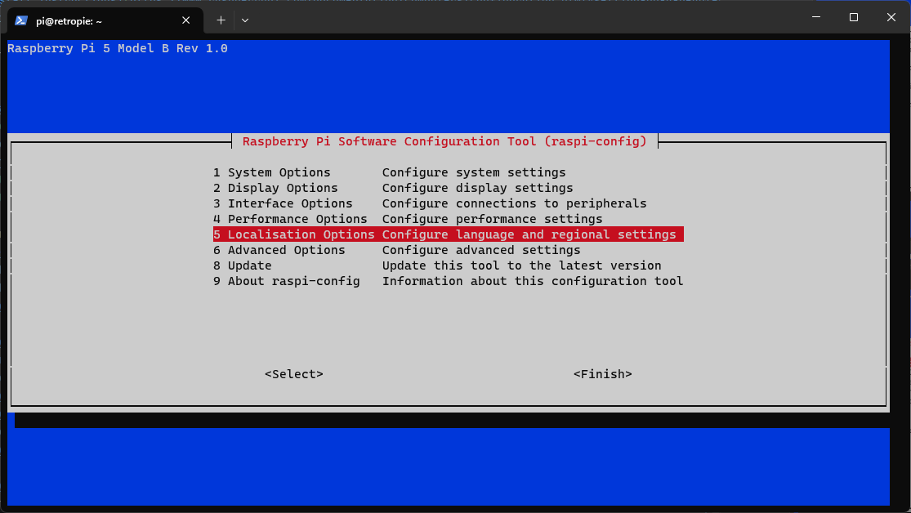
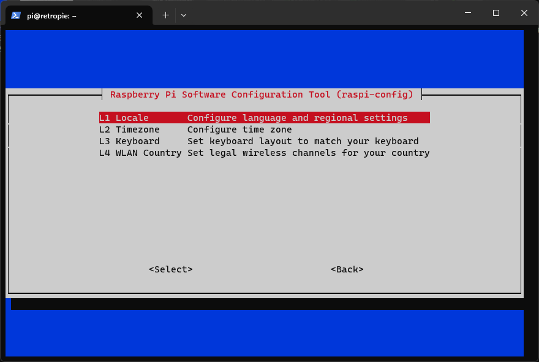
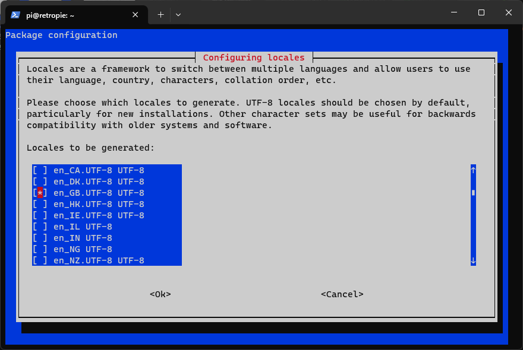

We will need to use the command line to [configure the OS](https://www.raspberrypi.com/documentation/computers/configuration.html). 
This can be done if you have a keyboard, mouse, and screen plugged into your Raspberry Pi, or it can be done over the 
network using SSH from another computer. If the plan is to use SSH, it would be best if you used the Raspberry Pi Imager 
when installing the OS to enable SSH and networking (see
[OS Customization](https://www.raspberrypi.com/documentation/computers/getting-started.html#advanced-options)). You may
also follow the
[headless install instructions](https://www.raspberrypi.com/documentation/computers/configuration.html#setting-up-a-headless-raspberry-pi).
This guide will not cover any of that, however, since the pre-mage image would not have networking/SSH enabled by 
default.

Regardless of how you gain access to the command line, the main thing here is that we update the locale settings so
that RetroPie can compile and install software correctly:

1. [Update package manager](https://www.raspberrypi.com/documentation/computers/os.html#updating-and-upgrading-raspberry-pi-os)
   using `sudo apt update` 
2. Upgrade software using `sudo apt upgrade`, entering `y` when prompted to continue
   
   
   
3. Configure the [locale settings](https://retropie.org.uk/docs/Manual-Installation/#verify-locale-settings) as this is
   vital for installation of RetroPie software to succeed correctly
    1. First make sure that the locale settings are correct for your environment using the
       [raspi-config](https://www.raspberrypi.com/documentation/computers/configuration.html) tool. You may also want to
       take the opportunity to set the Timezone, Keyboard, and WLAN Country (the latter of which is important for WiFi
       to work correctly). Start by entering `sudo raspi-config` and then select "Localisation Options"
       
    2. Select "Locale"
       
    3. If your locale is `en_GB.UTF-8 UTF-8` it is already selected. Otherwise, de-select that option, and then select
       the locale for your country (for example `en_us.UTF-8 UTF-8`)
       
       
        1. Select the default locale for the system environment
           
    4. Select "Finish" to exit the raspi-config tool.
       
4. It seems that the raspi-config tool has an issue currently setting all the locale settings, as seen when exiting
   the tool. Specifically the LANGUAGE and LC_ALL locale settings are unset.
   
    1. The `locale` command shows the _current_ settings, but changes made to locale do not take affect until after the
       system is restarted. So we need to use `sudo reboot` to restart the system
       
    2. Then we can use `locale` to show current settings, and we can see that LANGUAGE and LC_ALL are still unset
       
    3. Use the following commands to update both settings:
        1. `sudo update-locale LANGUAGE="en_US:en"`
        2. `sudo update-locale LC_ALL=en_US.UTF-8`
    4. Use `sudo reboot` to reboot the system and then use `locale` to confirm all the locale settings are configured
       
