Installing RetroPie should be as simple as following the
[manual install instructions](https://retropie.org.uk/docs/Manual-Installation/#install-retropie), as well as
configuring EmulationStation to [start on boot](https://retropie.org.uk/docs/FAQ/#how-do-i-boot-to-the-desktop-or-kodi)
and installing the bash welcome tweak. This again is in effort to set everything up as if this was an official image.

1. Use `sudo apt install git lsb-release` to install needed packages, pressing `y` to continue when prompted
   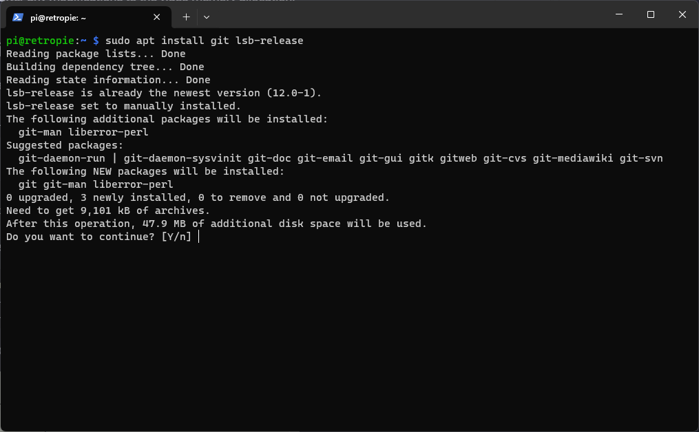
   
2. Use `git clone --depth=1 https://github.com/RetroPie/RetroPie-Setup.git` to download the setup scripts
   
3. Use `cd RetroPie-Setup` to enter into the setup directory
   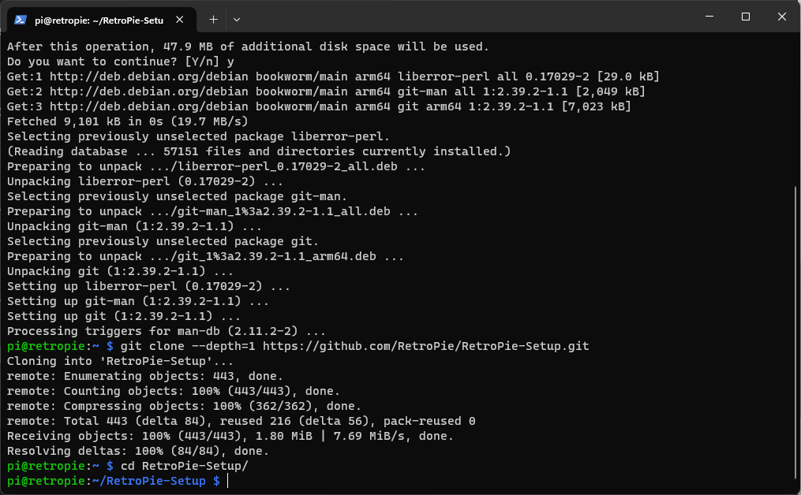
4. Use `chmod +x retropie_setup.sh` to make the retropie-setup script executable
   
5. Use `sudo ./retropie_setup.sh` to run the retropie-setup script. It will first install some additional packages and
   then launch the setup script. Select "OK" twice to accept the notice and acknowledge the warning about 64bit support
   
   
   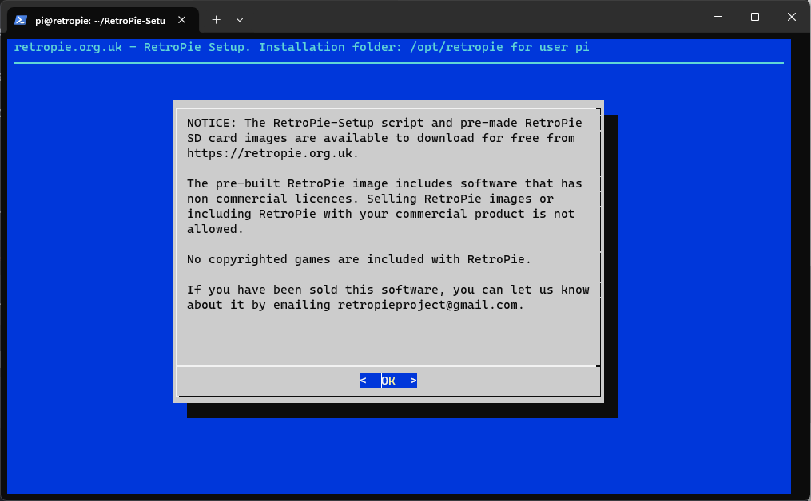
   
6. Select "Basic Install" and then "Yes" when asked if you are sure you want to do a basic install. This will take some
   time to complete, as it ends up compiling a lot of cores from source. You will know it's done when you see the
   RetroPie-Setup Script screen again
   
   
   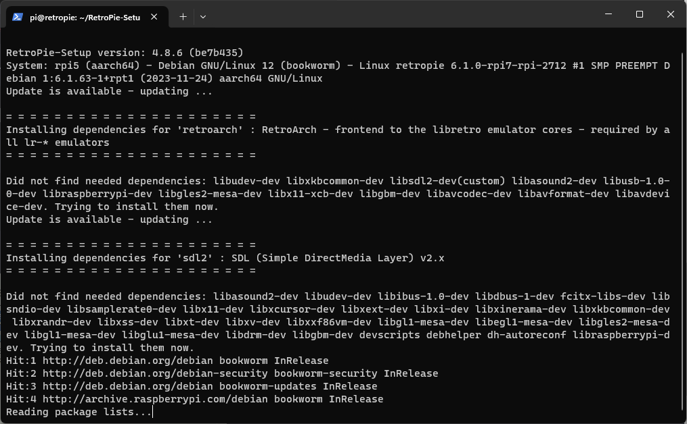
   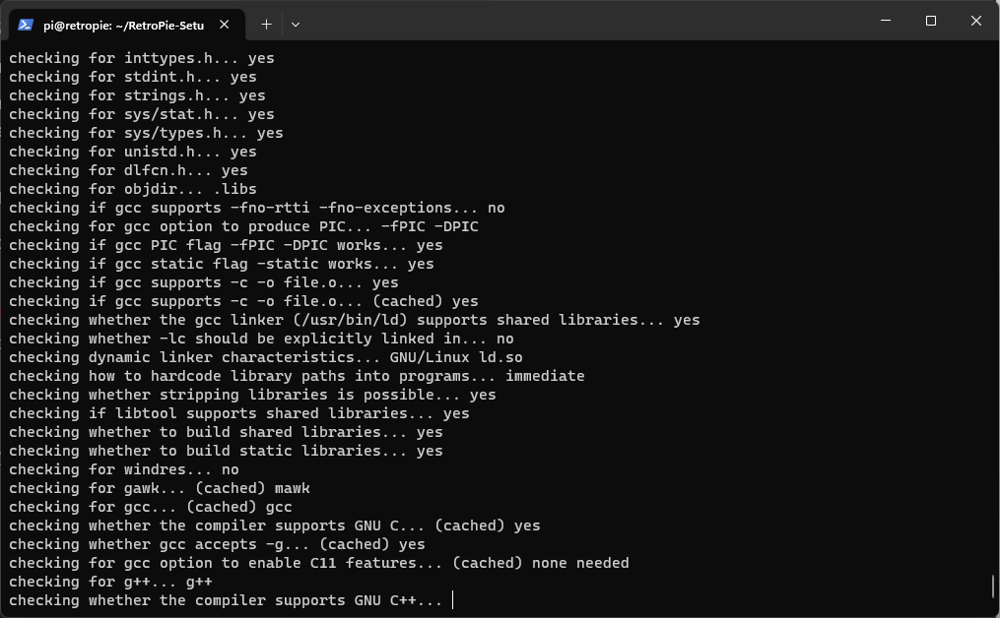
   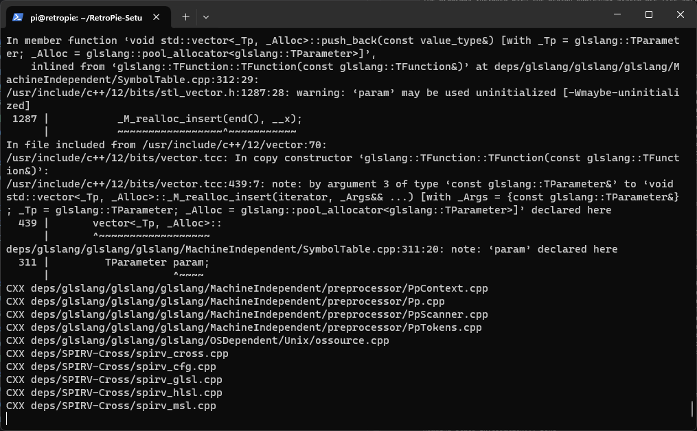
   
7. Back at the RetroPie-Setup Script, select "Configuration / tools"
   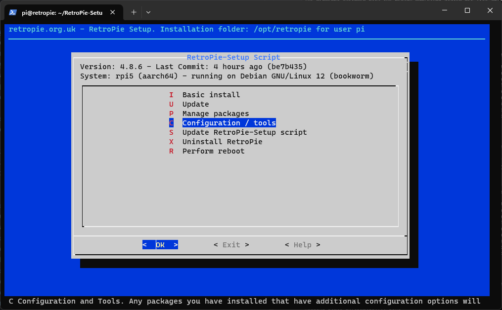
8. Select "autostart", and then "Start Emulation Station at boot", pressing "OK" when it confirms that Emulation Station
   is set to launch at boot
   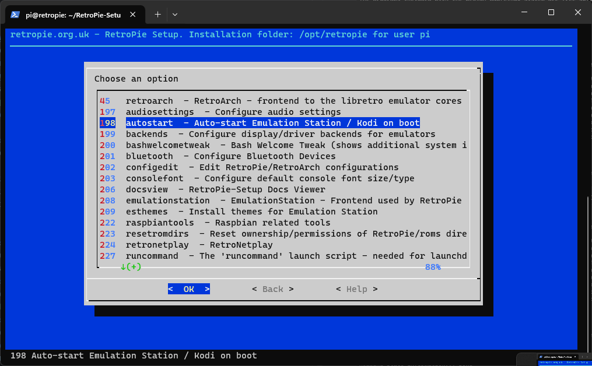
   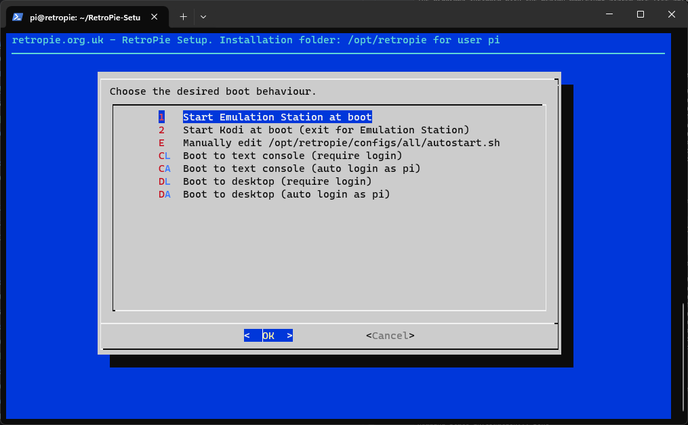
   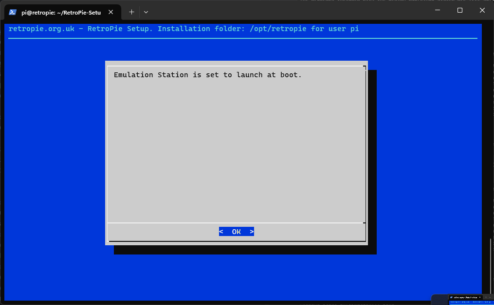
9. Select "bashwelcometweak", and then "Install Bash Welcome Tweak", again pressing "OK" when it confirms that it
   installed Bask Welcome Tweak
   
   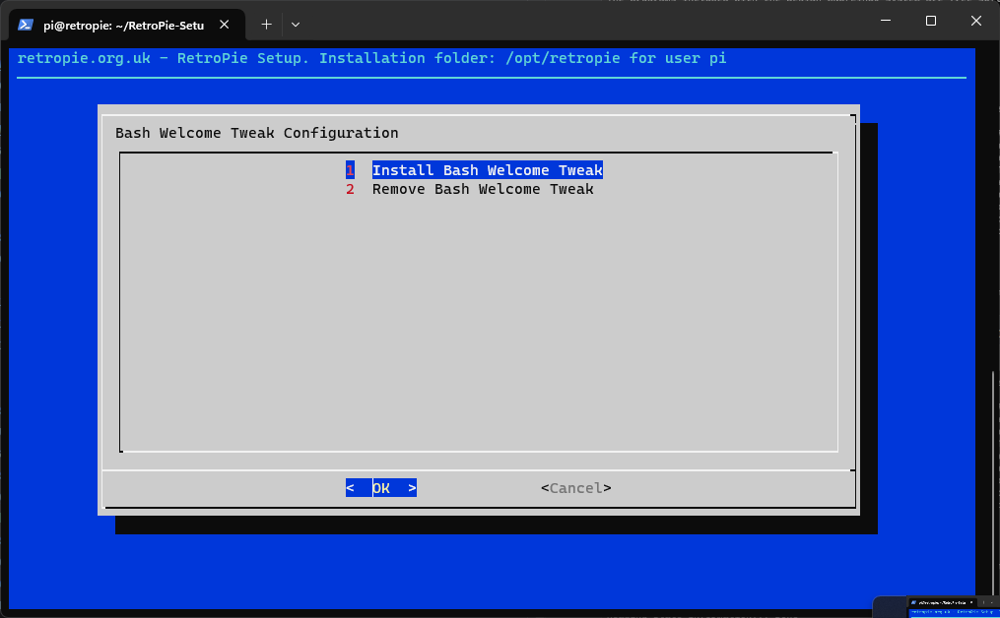
   


10. (Optional) Install usbromservice

By installing and enabling usbromservice, you can for example use ROMs from a USB thumb drive. 

Select ``manage packages``


Select ``Manage optional packages``


Scroll all the way down to `ùsbromservice```
and choose to install it.

Now configure it by selecting the same package.


Select ``enable USB ROM Service scripts``


To boot games from the USB, create a folder called 'retropie-mount' with on the USB drive.

The folder structure should be like below:
```bash
retropie-mount/
               nes/
                  super-marios.rom

               snes/
                   ...
                   ...

```


At this point, you can exit the RetroPie-Setup Script, and reboot. If everything works, you should now have a mostly
working RetroPie setup. There will likely need to be additional tweaks and cores to install in order to play everything.
