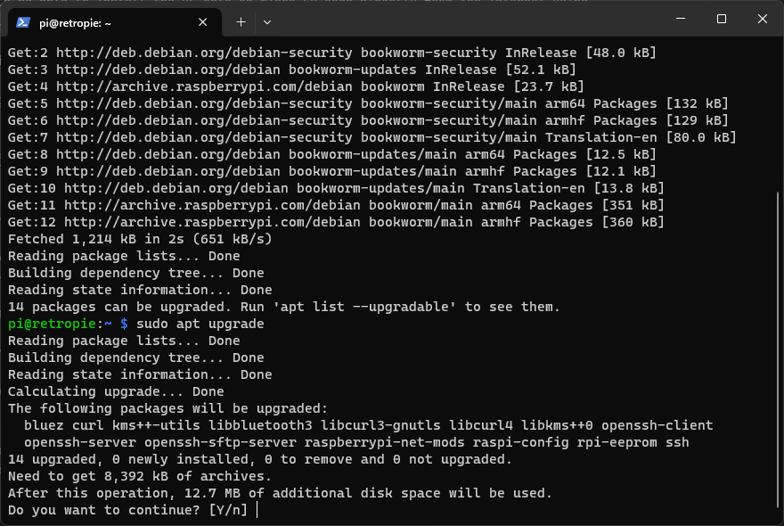
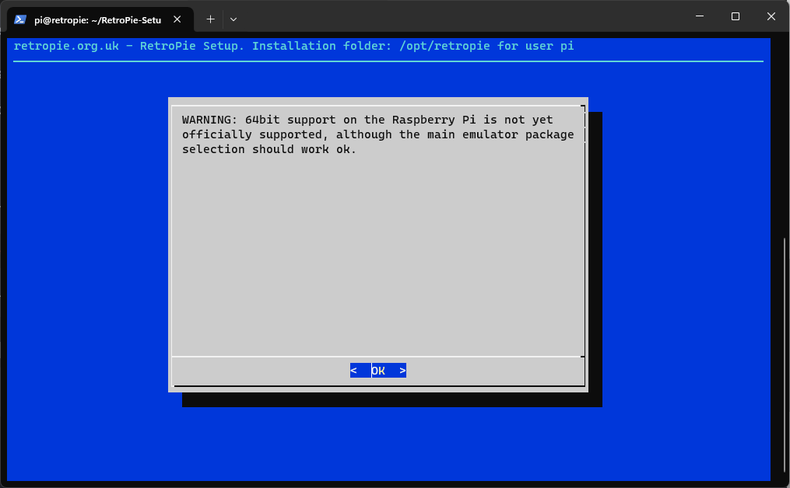

# raspberrypi5-retropie-setup
## Purpose of this guide
RetroPie currently does not provide a pre-made image for the Raspberry Pi 5. Also, the 
[latest image](https://retropie.org.uk/download/) at the time of writing this guide is v4.8 based on Raspbian with 
Debian 10 from March 14, 2022. 

The [GitHub for RetroPie](https://github.com/RetroPie/RetroPie-Setup) has active development and mostly supports the 
Raspberry Pi 5 and the latest Raspberry Pi OS with Debian 12. So a manual installation is possible, but the 
[official documentation](https://retropie.org.uk/docs/Manual-Installation/) is outdated and covers a wider range of 
hardware, which can make it hard to follow.

This guide will cover performing a manual installation specific to Raspberry Pi 5 hardware and will attempt to install 
RetroPie the same way it would be installed from a pre-made image. 

## Install OS
Raspberry Pi 4 used to be able to install the OS onto a microSD card directly from the internet using 
[Network Install](https://www.raspberrypi.com/documentation/computers/getting-started.html#install-over-the-network), 
without the need for another computer. However, this is not yet available for Raspberry Pi 5. So we will need another PC 
and a way to read/write to a microSD card.

[Write Raspberry Pi OS Lite (64-bit) to microSD card](./Write_OS_to_microSD_card.md)

After that, simply insert the microSD card into the Raspberry Pi 5 and turn it on. It will finish installing the OS, 
and then reboot. 

## OS Setup
[Raspberry Pi OS Configuration](https://www.raspberrypi.com/documentation/computers/configuration.html)

We will need to use the command line to configure the OS. This can be done if you have a keyboard, mouse, and screen 
plugged into your Raspberry Pi, or it can be done over the network using SSH from another computer. If the plan is to 
use SSH, it would be best if you used the Raspberry Pi Imager when installing the OS to enable SSH and networking (see
[OS Customization](https://www.raspberrypi.com/documentation/computers/getting-started.html#advanced-options)). You may 
also follow the 
[headless install instructions](https://www.raspberrypi.com/documentation/computers/configuration.html#setting-up-a-headless-raspberry-pi). 
This guide will not cover that, however, since the pre-mage image would not have networking/SSH enabled by default.

Regardless of how you gain access to the command line, the main thing here is that we update the locale settings so 
that RetroPie can compile and install software correctly:

1. [Update package manager](https://www.raspberrypi.com/documentation/computers/os.html#updating-and-upgrading-raspberry-pi-os)
   using `sudo apt update` 
2. Upgrade software using `sudo apt upgrade`, entering `y` when prompted to continue
   
   
   
3. Configure the [locale settings](https://retropie.org.uk/docs/Manual-Installation/#verify-locale-settings) as this is 
   vital for installation of RetroPie software to succeed correctly
   1. First make sure that the locale settings are correct for your environment using the 
      [raspi-config](https://www.raspberrypi.com/documentation/computers/configuration.html) tool. You may also want to
      take the opportunity to set the Timezone, Keyboard, and WLAN Country (the latter of which is important for WiFi 
      to work correctly). Start by entering `sudo raspi-config` and then select "Localisation Options" 
      
   2. Select "Locale"
      
   3. If your locale is `en_GB.UTF-8 UTF-8` it is already selected. Otherwise, de-select that option, and then select 
      the locale for your country (for example `en_us.UTF-8 UTF-8`)
      
      
      1. Select the default locale for the system environment
         
   4. Select "Finish" to exit the raspi-config tool.
      
4. It seems that the raspi-config tool has an issue currently setting all the locale settings, as seen when exiting 
   the tool. Specifically the LANGUAGE and LC_ALL locale settings are unset.
   
   1. The `locale` command shows the _current_ settings, but changes made to locale do not take affect until after the 
      system is restarted. So we need to use `sudo reboot` to restart the system
      
   2. Then we can use `locale` to show current settings, and we can see that LANGUAGE and LC_ALL are still unset
      
   3. Use the following commands to update both settings:
      1. `sudo update-locale LANGUAGE="en_US:en"`
      2. `sudo update-locale LC_ALL=en_US.UTF-8`
   4. Use `sudo reboot` to reboot the system and then use `locale` to confirm all the locale settings are configured
      

## Install RetroPie
Installing RetroPie should be as simple as following the 
[manual install instructions](https://retropie.org.uk/docs/Manual-Installation/#install-retropie), as well as 
configuring EmulationStation to [start on boot](https://retropie.org.uk/docs/FAQ/#how-do-i-boot-to-the-desktop-or-kodi) 
and installing the bash welcome tweak. This again is in effort to set everything up as if this was an official image.

1. Use `sudo apt install git lsb-release` to install needed packages, pressing `y` to continue when prompted
   
   
2. Use `git clone --depth=1 https://github.com/RetroPie/RetroPie-Setup.git` to download the setup scripts
   
3. Use `cd RetroPie-Setup` to enter into the setup directory
   
4. Use `chmod +x retropie_setup.sh` to make the retropie-setup script executable
   
5. Use `sudo ./retropie_setup.sh` to run the retropie-setup script. It will first install some additional packages and 
   then launch the setup script. Select "OK" twice to accept the notice and acknowledge the warning about 64bit support 
   
   
   
   
6. Select "Basic Install" and then "Yes" when asked if you are sure you want to do a basic install. This will take some 
   time to complete, as it ends up compiling a lot of cores from source. You will know it's done when you see the
   RetroPie-Setup Script screen again
   
   
   
   
   
   
7. Back at the RetroPie-Setup Script, select "Configuration / tools"
   
8. Select "autostart", and then "Start Emulation Station at boot", pressing "OK" when it confirms that Emulation Station 
   is set to launch at boot
   
   
   
9. Select "bashwelcometweak", and then "Install Bash Welcome Tweak", again pressing "OK" when it confirms that it 
   installed Bask Welcome Tweak
   
   
   

At this point, you can exit the RetroPie-Setup Script, and reboot. If everything works, you should now have a mostly 
working RetroPie setup. There will likely need to be additional tweaks and cores to install in order to play everything.
